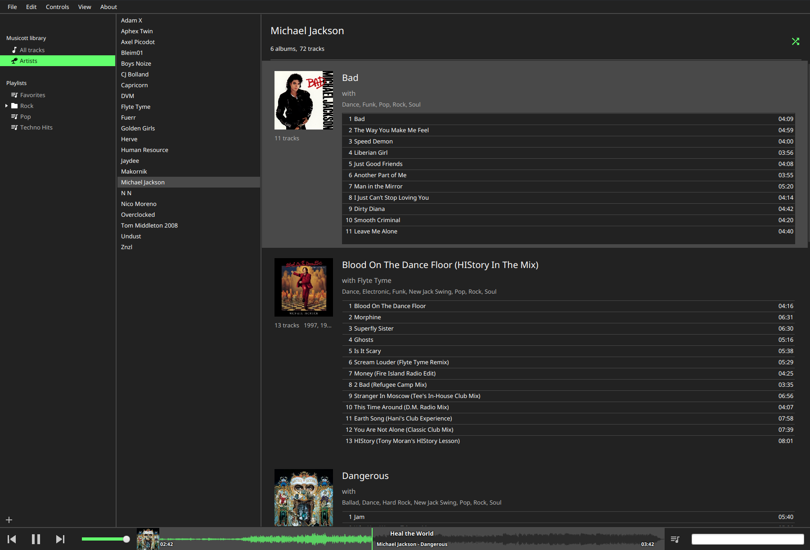

# Musicott


[](https://sonarcloud.io/summary/new_code?id=octaviospain_musicott)
[](https://sonarcloud.io/summary/new_code?id=octaviospain_musicott)
[](https://github.com/octaviospain/Musicott/blob/master/license/gpl.txt)
[](https://github.com/octaviospain/Musicott/releases/latest)

A cross-platform desktop music player built with JavaFX and Spring Boot, on top of [music-commons](https://github.com/octaviospain/music-commons) and [lirp persistence](https://github.com/octaviospain/lirp). Manage your local music library, organize playlists, play tracks with waveform visualization, and import from iTunes.

I started this project in my university years as a small pet project to solve a problem with audio metadata tagging, in the times when I started to DJ. Back then I used iTunes to organize my music library and when I started to use DJ software and import my files there, it turned out that iTunes was not writing the track information I spent so much time curating into the file metadata tags, therefore having a frustrated experience since I spent so much time tagging my entire music library in order to find the tracks I wanted to play in my sets with ease.

Therefore I started a cli tool that parsed the itunes library xml file and wrote the info into the track metadata using **[JAudioTagger](https://github.com/ericfarng/jaudiotagger)**. Easy-peasy. However, why stop there? I was studying to become a software engineer so, why not build my own music library app?
That became Musicott, the project I spent countless hours learning to code alongside my studies with the ambition to have some features that I did not find in other similar apps while helping me become a better Software Engineer.

## Architecture

That was 9 years ago and since then I decided to refactor and redesign its architecture with the knowledge I started to accumulate, and as a result, this project got split into 3:

* [lirp = Lightweight Reactive Persistence](https://github.com/octaviospain/lirp): initially Musicott was persisting the state of the audio library to a json file using [Json-io](https://github.com/jdereg/json-io) asynchronously. I decided to create my own library to supply this need that I did not find anywhere else, since using another smaller solution like SQLite seemed an overkill to me. LIRP does that and became its own project where I learned [Kotlin Coroutines](https://github.com/Kotlin/kotlinx.coroutines), and [kotlinx.serialization](https://github.com/Kotlin/kotlinx.serialization), inspired by Domain-Driven Design concepts and an opinionated approach to Object Oriented Programming and event sourcing for lightweight projects, that supports asynchronous serialization to json and sql databases.

* [music-commons](https://github.com/octaviospain/music-commons): as a result of splitting the persistence layer and the presentation layer from the project, what remains in the middle is the core 'business' logic of the app: a music library and related utilities library that is persistence-agnostic built on top of LIRP. This project became the central development of the last 3-4 years since I envisioned it to be a library that other Java and Kotlin developers could use to build their music-related apps in an event-driven/event sourcing way, opening the way to other projects I have in mind too.

* Musicott, this project itself, the desktop app written in JavaFX isolating the view on top of music-commons. Under the hood it boots Spring Boot in non-web mode and uses [`javafx-weaver-spring`](https://github.com/rgielen/javafx-weaver) to wire FXML controllers as Spring beans, with components talking to each other through Spring `ApplicationEvent` publishing rather than direct references.

After years of this refactoring and redesign work, in April 2026 I moved the old code to the `master-legacy` branch and I will start releasing again.



## Key Features

- **Local-first music library** — your collection lives on your disk, persisted as plain JSON files under `~/.config/musicott/` (no database, no cloud sync)
- **iTunes XML import** — bring your existing iTunes library across with playlists and metadata intact
- **Hierarchical playlists** — folders of playlists, drag-and-drop reordering, and full-text search across the library
- **Waveform visualization** — generated once per track, cached locally, and used for visual seeking during playback
- **Native installers** for Linux (AppImage / AUR), Windows, and macOS — no JDK install required by end users

## Download

**[Latest release →](https://github.com/octaviospain/Musicott/releases/latest)**

| Platform | Installer |
|----------|-----------|
| Linux    | `Musicott-X.Y.Z-x86_64.AppImage` (or `yay -S musicott` from the AUR) |
| Windows  | `Musicott-X.Y.Z.exe` |
| macOS    | `Musicott-X.Y.Z.dmg` |

> **Note:** Installers are unsigned. See the [Install guide](https://github.com/octaviospain/Musicott/wiki/Install) for the one-time security workaround on macOS and Windows.

## User Guide

WIP documentation lives in the **[GitHub wiki](https://github.com/octaviospain/Musicott/wiki)**:

- [Importing music](https://github.com/octaviospain/Musicott/wiki/Import) (including iTunes XML)
- [Playback](https://github.com/octaviospain/Musicott/wiki/Playback)
- [Playlists](https://github.com/octaviospain/Musicott/wiki/Playlists)
- [Search](https://github.com/octaviospain/Musicott/wiki/Search)

## Build from source

### Requirements

- **JDK 24+** with JavaFX modules (Liberica Full or Azul Zulu FX bundle the SDK; alternatively install JavaFX SDK separately and pass it on the module path)
- **Gradle 9.4+** — the system `gradle` binary is recommended; the bundled wrapper also works
- **Linux only:** GTK and the Monocle native bits are required for headless tests in CI; on a desktop you already have them

### Common commands

```bash
# Compile Java + Kotlin
gradle clean compileJava compileKotlin

# Launch the app
gradle run

# Build the fat JAR
gradle jar

# Full build with all tests + coverage
gradle build
```

### Tests

Tests are split across four Gradle source sets and run headless by default via TestFX/Monocle:

```bash
gradle test               # Unit tests        (src/test/, *Test)
gradle integrationTest    # Spring + DI tests (src/integrationTest/, *IT)
gradle uiTest             # TestFX UI tests   (src/uiTest/, *UIT)
gradle e2eTest            # End-to-end tests  (src/e2eTest/, *E2E)
gradle check              # All of the above + JaCoCo coverage
```

Pass `-Dtestfx.headless=false` on any test task to watch the UI execute against a real screen.

## Contributing

Contributions are welcome — bug reports, feature suggestions, and pull requests. Please read [**CONTRIBUTING.md**](./CONTRIBUTING.md) before opening a PR; it documents the branch naming convention, test source-set structure, problem-statement requirement, and commit-message format.

## License and Attributions

Copyright (c) 2026 Octavio Calleya Garcia.

Musicott is free software under GNU GPL version 3 license, available [here](https://www.gnu.org/licenses/gpl-3.0.en.html#license-text).